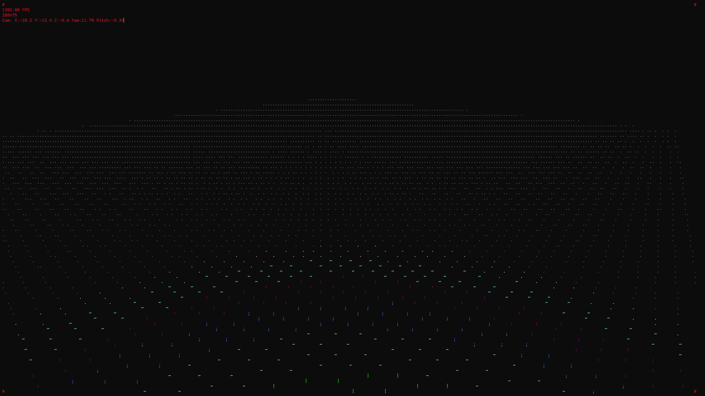
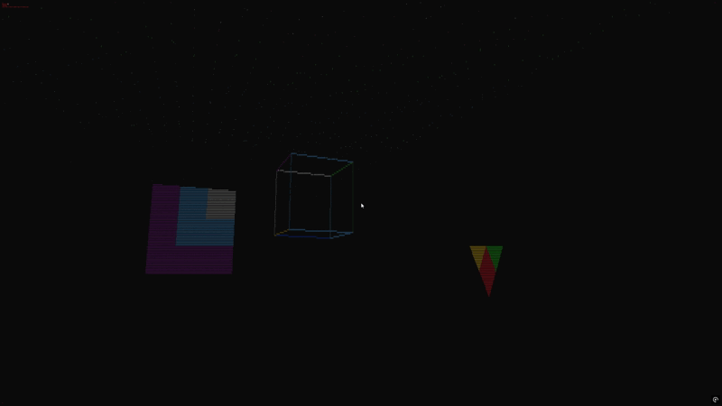

# 🗔 ASCIILATOR
>A blazing-fast, experimental ASCII game engine from inside a Windows CMD. Render 3D wireframes and dynamic visuals directly in to your console using **only ANSI escape codes and pure C**.

---

## 🚀 Why Use This Engine?

- **Zero dependencies:** No libraries, no frameworks, no runtime bloat. Just raw C and your Windows console.
- **Instant install & run:** Download, build, and play—no setup, no package managers, no headaches.
- **ASCII based graphics** costume face, edge, dot **Graphics and Shader**, real-time camera, smooth animation and simple texture managment.

---

## ⚪ Quick Start

1. **Install GCC** (MinGW or MSYS2 recommended, but any GCC for Windows works).
2. Open the UCRT64 MSYS2 terminal, navigate to project `root` directory.
3. Run:
   ```
   ./install.bat
   ```
   This builds everything—no libraries, no extra steps.
4. Run the engine:
   ```
   ./engine.exe
   ```

**That’s it!** No libraries, no dependencies, no Python, no CMake, no makefiles. Just raw C and Windows.

---

## 🎮 Controls

- `W/A/S/D` — Move camera forward/left/back/right.
- `SPACE/CTRL` — Move camera up/down.
- `Q/E` — Turn camera left/right.
- `R/F` — Look up/down.
- **Mouse** — Look around (if supported).
- `Shift` — Move faster.
- `Esc` — Exit.

---

## 🛠️ Main Features

- **Dynamic FPS display**.
- **Optimized buffer output** for smooth animation.
- **Minimal dependencies** (just GCC and Windows).
- **Realtime zoom in and out** (Change resolution on fly).
- **Costume Shader, Textures, Animations**.

---

## 🎨 ASCII Color & Character "Shader" (Depth-based Visuals)

The engine uses a simple but effective "shader" based system for clock, angle and depth ASCII rendering:

- **ASCII-Color Shader** Characters and their Color change, based on distance, angle, speed of the camera.

You can customize shaders in `SHADER.c` or use the provided `edge_shader` and `dot_shader` helpers.

---

## 🟢 Adding Dots (Single-Point Rendering)

The engine supports rendering individual points (dots) in 3D space. This is useful for creating stars, particles, or other single-point visuals.

**Example:**
```c
// Create a dot at (x, y, z)
dot d = dot_shader((vertex){x, y, z});
// Add to your dot array and pass to draw_unified()
```

---

## 🔵 Adding Edges (Line Rendering)

The engine supports rendering edges (lines) between two points in 3D space. This is the foundation of wireframe rendering.

**How to Add Edges:**
```c
// Create an edge between two vertices
edge e = create_edge_with_shader((vertex){x1, y1, z1}, (vertex){x2, y2, z2});
// Add to your edge array and pass to draw_unified()
```

---

## 🟣 Adding Faces (Triangle/Quad Rendering)

Faces are triangles or quads defined by 3 or 4 vertices. They can be flat-colored or textured.

**Example:**
```c
// Create face examples
face test_faces[2];

// Triangle face example
faces[0].vertex_count = 3;
faces[0].vertices[0] = (vertex){.0f, .0f, .0f};
faces[0].vertices[1] = (vertex){-50.0f, .0f, .0f};
faces[0].vertices[2] = (vertex){.0f, 50.0f, 0.0f};
faces[0].texture = simple_texture;
faces[0].texture_width = 8;
faces[0].texture_height = 8;
faces[0].color = 93; // Bright yellow fallback
faces[0].ascii = '#';

// Quad face example
faces[1].vertex_count = 4;
faces[1].vertices[0] = (vertex){30.0f, 10.0f, 60.0f};
faces[1].vertices[1] = (vertex){20.0f, 10.0f, 50.0f};
faces[1].vertices[2] = (vertex){30.0f, 30.0f, 60.0f};
faces[1].vertices[3] = (vertex){30.0f, 20.0f, 40.0f};
faces[1].texture = simple_texture;
faces[1].texture_width = 8;
faces[1].texture_height = 8;
faces[1].color = 96; // Bright cyan fallback
faces[1].ascii = '@';
```

---

## 🟠 Adding Meshes (3D Object Rendering)

Meshes are collections of edges, dots, and faces. To render a mesh, collect its primitives and call the unified renderer.

**How to Add Meshes:**
```c
// Prepare arrays of edges, dots, and faces
edge edges[] = { ... };
dot dots[] = { ... };
face faces[] = { ... };

// Call the unified draw function
draw_unified(edges, edge_count, dots, dot_count, faces, face_count);
```
## 🔴 Face Rotation and Depth Shaders

The engine now supports advanced shading for faces based on their depth and rotation relative to the camera. This enhances the 3D effect and provides more dynamic visuals.

### Depth Shader for Faces
- **ASCII Characters**: Characters change based on the distance of the face from the camera.
- **Color Shading**: Colors are selected dynamically based on depth, using ANSI color codes.

### Rotation Shader for Faces
- **Dynamic Characters**: Characters change based on the angle between the face's normal and the camera's view direction.
- **Enhanced Realism**: Provides a sense of orientation and depth for each face.

### Example Usage
```c
// Create a triangle face
vertex vertices[3] = {
    {0.0f, 0.0f, 0.0f},
    {-50.0f, 0.0f, 0.0f},
    {0.0f, 50.0f, 0.0f}
};
face shaded_face = create_face_with_shader(vertices, 3, test_texture, 8, 8);

// Create a quad face
vertex central_vertices[4] = {
    {-5.0f, -5.0f, 0.0f},
    {5.0f, -5.0f, 0.0f},
    {5.0f, 5.0f, 0.0f},
    {-5.0f, 5.0f, 0.0f}
};
faces[0] = create_face_with_shader(central_vertices, 4, test_texture, 8, 8);
```

These shaders are implemented in `SHADER.c` and can be customized further to suit your needs.

---

## 🖼️ Rendering Pipeline

1. **Prepare geometry:** Fill arrays of `edge`, `dot`, and `face` structs.
2. **Call `draw_unified(...)`:** This handles depth sorting, Z-buffering, and efficient redraw.
3. **The engine projects, sorts, and draws everything with correct depth, color and ascii.**

---

## 📁 Directory Structure

```
ASCIILATOR/
│
├── bin/                // Compiled binaries and executables (NOT USED)
├── engine/             // Core engine source code
│   ├── camera/         // Camera system for 3D navigation
│   │   ├── CAMERA.c
│   │   └── CAMERA.h
│   ├── input/          // Input handling (keyboard/mouse)
│   │   ├── INPUT.c
│   │   └── INPUT.h
│   ├── rasterizer/     // Rasterization and rendering logic
│   │   ├── RASTERIZER.c
│   │   └── RASTERIZER.h
│   ├── render/         // Frame buffer and output system
│   │   ├── DOT_ANIMATION.h
│   │   ├── EDGE_ANIMATION.h
│   │   ├── EDGE_DRAWER.h
│   │   ├── FACE_DRAWER.h
│   │   ├── FACE_TEXTURE.h
│   │   ├── RENDER.c
│   │   └── RENDER.h
│   ├── shader/         // ASCII and color shader logic
│   │   ├── SHADER.c
│   │   └── SHADER.h
│   └── ENGINE.c        // Main engine entry point
├── resource/           // Resources like textures and animations
│   ├── plane.png
│   └── render.gif
├── install.bat         // Build script
├── engine.exe          // Compiled executable
├── LICENSE             // MIT license
├── README.md           // Project documentation
```

---


## 📸 Screenshots

Here is an example of the engine rendering a grid of dots with depth-based ASCII and color shading:



---

## 🎨 ASCII and Color Edge Shader in Action

The screenshot above demonstrates the engine's depth-based ASCII and color shading system:

- **ASCII Shader**: Characters change based on their distance from the camera, providing a sense of depth. For example, closer dots use characters like `#` or `@`, while farther dots use lighter characters like `.` or `:`.
- **Color Shader**: Colors are selected based on depth, using ANSI color codes. Closer objects use brighter colors (e.g., red or green), while farther objects use dimmer colors (e.g., blue or cyan).

This dynamic shading system enhances the 3D effect and makes the visuals more engaging.

---

## 🎥 Animation Showcase

Below is a showcase of the engine's rendering capabilities:



---

## 👤 Credits

- Inspired by the Vectrex console and classic wireframe games.
- Developed by Nikita Konkov.

## 📝 License

This project is licensed under the MIT License - see the [LICENSE](./LICENSE) file for details.

---

_"ASCIILATOR: ASCII Console 3D Render Engine!"_
---
